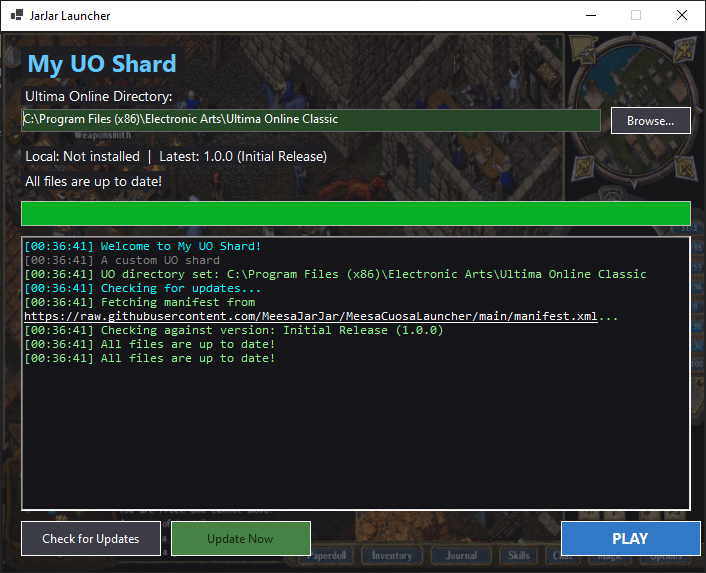

# JarJarLauncher - Configurable UO Shard Launcher

**JarJarLauncher** is a fully configurable game launcher for Ultima Online shards. It provides automatic updates via any web server (GitHub, your website, etc.), customizable UI, and flexible launch parameters - all controlled through a simple JSON configuration file.

---

## 🚀 Features

- ✅ **Fully Configurable** - Everything controlled via `shard_config.json`
- ✅ **Flexible Update Sources** - Works with GitHub, your website, or any HTTP/HTTPS URL
- ✅ **MD5 Hash Verification** - Ensures file integrity
- ✅ **Automatic Backups** - Creates backups before updates
- ✅ **Customizable UI** - Colors, text, window size, and more
- ✅ **Flexible Launch Arguments** - Support for custom client parameters
- ✅ **User Settings Preservation** - Protects user data during updates
- ✅ **Cross-Platform Ready** - Built on .NET 9

---

## 📋 Quick Start for Shard Developers

### Step 1: Host Your Client Files

Host your files on **GitHub** or **your own website**:

| Option | Example URL |
|--------|-------------|
| **GitHub** | `https://raw.githubusercontent.com/user/repo/main/` |
| **Your Website** | `https://yourshard.com/client/` |

### Step 2: Create a `manifest.xml` File

Upload your manifest alongside your client files (see template below).

### Step 3: Configure the Launcher

1. Download `JarJarLauncher.exe`
2. Edit `shard_config.json` with your URLs and shard details
3. Distribute the launcher to your players

### Step 4: Players Download and Play

1. Players run `JarJarLauncher.exe`
2. Launcher auto-downloads/updates files
3. Players click PLAY!

---

## 🌐 Hosting Options

The launcher uses standard HTTP/HTTPS requests - it works with **any URL** that returns the expected files.

### Option A: GitHub (Free & Easy)

```json
{
  "manifest_url": "https://raw.githubusercontent.com/YourUsername/YourRepo/main/manifest.xml",
  "download_base_url": "https://raw.githubusercontent.com/YourUsername/YourRepo/main"
}
```

**Pros:** Free, version control, easy updates  
**Cons:** File size limits, bandwidth limits for large shards

### Option B: Your Own Website

```json
{
  "manifest_url": "https://yourshard.com/client/manifest.xml",
  "download_base_url": "https://yourshard.com/client"
}
```

**Server folder structure:**
```
yourshard.com/
└── client/
    ├── manifest.xml          ← manifest_url points here
    ├── ClassicUO.exe         ← files download from here
    ├── ClassicUO.dll
    └── Data/
        └── config.xml
```

**Pros:** Full control, no limits, faster for large files  
**Cons:** Requires web hosting

### Web Server Requirements

For self-hosted options, ensure:
- ✅ Files are publicly accessible (no login required)
- ✅ HTTPS is recommended (HTTP works but isn't secure)
- ✅ No hotlink protection blocking the launcher

---

## 🔧 Configuration Guide

### `shard_config.json` Structure

```json
{
  "shard_name": "Your Shard Name",
  "shard_description": "Welcome message for players",
  "manifest_url": "https://raw.githubusercontent.com/YourUsername/YourRepo/main/manifest.xml",
  "download_base_url": "https://raw.githubusercontent.com/YourUsername/YourRepo/main",
  "client_executable": "ClassicUO.exe",
  "client_working_directory": null,
  "server_address": "play.yourshard.com",
  "server_port": 2593,
  "base_arguments": [
    {
      "key": "-ip",
      "value": "{SERVER_ADDRESS}",
      "is_quoted": false,
      "description": "Server IP address"
    },
    {
      "key": "-port",
      "value": "{SERVER_PORT}",
      "is_quoted": false,
      "description": "Server port"
    },
    {
      "key": "-ultimaonlinedirectory",
      "value": "{UO_DIRECTORY}",
      "is_quoted": true,
      "description": "Path to UO installation"
    }
  ],
  "custom_arguments": [],
  "ui_settings": {
    "title": "Your Shard Launcher",
    "window_width": 720,
    "window_height": 580,
    "theme": {
      "background_color": "#1E1E23",
      "title_color": "#64C8FF",
      "text_color": "#FFFFFF",
      "button_background": "#3C3C46",
      "button_text_color": "#FFFFFF",
      "play_button_background": "#3278C8",
      "update_button_background": "#468246",
      "update_button_highlight": "#C89632",
      "log_background": "#141419",
      "log_text_color": "#90EE90",
      "textbox_background": "#323237",
      "textbox_valid_background": "#284628",
      "textbox_invalid_background": "#462828"
    },
    "show_uo_directory_field": true,
    "show_version_label": true,
    "play_button_text": "PLAY",
    "check_button_text": "Check for Updates",
    "update_button_text": "Update Now"
  },
  "backups_to_keep": 5,
  "preserved_paths": [
    "Data",
    "Profiles",
    "settings.json",
    "backup"
  ],
  "auto_check_updates": true,
  "close_launcher_on_game_start": true,
  "http_timeout_seconds": 300,
  "user_agent": "YourShardLauncher/1.0"
}
```

---

## 🔑 Configuration Options Explained

### **Shard Identity**

| Option | Description | Example |
|--------|-------------|---------|
| `shard_name` | Your shard's name (shown in UI) | `"Legends of Britannia"` |
| `shard_description` | Welcome message for players | `"Welcome to our custom shard!"` |

### **Update Sources**

| Option | Description | Example |
|--------|-------------|---------|
| `manifest_url` | Full URL to your `manifest.xml` file | Any HTTP/HTTPS URL |
| `download_base_url` | Base URL for downloading files (files are appended to this) | Any HTTP/HTTPS URL |

**How file downloads work:**
```
download_base_url + "/" + filename from manifest = full download URL

Example:
  download_base_url: "https://yourshard.com/client"
  manifest file: "ClassicUO.exe"
  downloads from: "https://yourshard.com/client/ClassicUO.exe"
```

### **Client Configuration**

| Option | Description | Example |
|--------|-------------|---------|
| `client_executable` | Name of the game executable | `"ClassicUO.exe"` |
| `client_working_directory` | Subdirectory for the client (optional) | `null` or `"client"` |

### **Server Connection**

| Option | Description | Example |
|--------|-------------|---------|
| `server_address` | Your shard's IP or domain | `"play.myshard.com"` |
| `server_port` | Your shard's port | `2593` |

### **Launch Arguments**

Launch arguments support variable substitution:

| Variable | Replaced With |
|----------|---------------|
| `{SERVER_ADDRESS}` | Value from `server_address` |
| `{SERVER_PORT}` | Value from `server_port` |
| `{UO_DIRECTORY}` | User's UO installation path |

**Example Custom Arguments:**

```json
"custom_arguments": [
  {
    "key": "-debug",
    "value": "true",
    "is_quoted": false,
    "description": "Enable debug mode"
  },
  {
    "key": "-customfeature",
    "value": "enabled",
    "is_quoted": false,
    "description": "Enable custom feature"
  },
  {
    "key": "-datapath",
    "value": "C:\\MyData",
    "is_quoted": true,
    "description": "Custom data path"
  }
]
```

### **UI Customization**

Customize the launcher's appearance:

- **Window Size**: `window_width` and `window_height`
- **Background Image**: Automatically uses `background.png` if present
- **Colors**: All colors use hex format (`#RRGGBB`)
- **Button Text**: Customize button labels
- **Optional Fields**: Hide/show UO directory field and version label

#### Background Image

Simply place a file named `background.png` in the same folder as the launcher - it will automatically be used as the background!

```json
"ui_settings": {
  "background_image_opacity": 0.3
}
```

| Option | Description | Default |
|--------|-------------|---------|
| `background_image_opacity` | Opacity from 0.0 (invisible) to 1.0 (fully visible) | `0.3` |

**Tips:**
- Use opacity `0.2` - `0.4` for best readability with text
- Image will scale to fit the window size
- Supported formats: PNG (recommended), JPG, BMP, GIF

### **Advanced Settings**

| Option | Description | Default |
|--------|-------------|---------|
| `backups_to_keep` | Number of backup archives to keep | `5` |
| `preserved_paths` | Files/folders protected from updates | `["Data", "Profiles", ...]` |
| `auto_check_updates` | Check for updates on startup | `true` |
| `close_launcher_on_game_start` | Auto-close launcher when game starts | `true` |
| `http_timeout_seconds` | Download timeout in seconds | `300` |

---

## 📦 Creating Your `manifest.xml`

The manifest file tells the launcher what files to download and their MD5 hashes for verification.

### Manifest Template

```xml
<?xml version="1.0" encoding="utf-8"?>
<releases>
  <release version="1.0.0" name="Initial Release">
    <files>
      <file filename="ClassicUO.exe" hash="abc123..." />
      <file filename="ClassicUO.dll" hash="def456..." />
      <file filename="Data/config.xml" hash="ghi789..." />
      <!-- Add all your files here -->
    </files>
  </release>
</releases>
```

### Generating MD5 Hashes

**PowerShell:**
```powershell
Get-FileHash -Algorithm MD5 "ClassicUO.exe" | Select-Object -ExpandProperty Hash
```

**Linux/Mac:**
```bash
md5sum ClassicUO.exe
```

**Online Tools:**
- Use any online MD5 hash calculator

---

## 🎨 UI Theme Examples

### Dark Blue Theme
```json
"theme": {
  "background_color": "#0D1B2A",
  "title_color": "#00B4D8",
  "text_color": "#CAF0F8",
  "button_background": "#1B263B",
  "play_button_background": "#0077B6"
}
```

### Forest Green Theme
```json
"theme": {
  "background_color": "#1B2E1F",
  "title_color": "#7CB342",
  "text_color": "#C5E1A5",
  "button_background": "#2E4A32",
  "play_button_background": "#558B2F"
}
```

### Purple Fantasy Theme
```json
"theme": {
  "background_color": "#2B1B3D",
  "title_color": "#A855F7",
  "text_color": "#DDD6FE",
  "button_background": "#4C1D95",
  "play_button_background": "#7C3AED"
}
```

---

## 🛠️ Advanced Examples

### Example 1: Custom Server with JarJar Features

```json
{
  "shard_name": "JarJar's Legends",
  "server_address": "play.jarjarlegends.com",
  "server_port": 2593,
  "custom_arguments": [
    {
      "key": "-jarjar",
      "value": "true",
      "is_quoted": false
    },
    {
      "key": "-jarjar_updater",
      "value": "true",
      "is_quoted": false
    },
    {
      "key": "-jarjar_updater_url",
      "value": "https://yourshard.com/gameArt.php",
      "is_quoted": true
    },
    {
      "key": "-jarjar_music",
      "value": "true",
      "is_quoted": false
    },
    {
      "key": "-jarjar_music_url",
      "value": "https://yourshard.com/gameMusic.php",
      "is_quoted": true
    }
  ]
}
```

### Example 2: Minimal Configuration (Standalone Client)

```json
{
  "shard_name": "My Shard",
  "manifest_url": "https://raw.githubusercontent.com/user/repo/main/manifest.xml",
  "download_base_url": "https://raw.githubusercontent.com/user/repo/main",
  "server_address": "127.0.0.1",
  "server_port": 2593,
  "ui_settings": {
    "show_uo_directory_field": false,
    "show_version_label": false
  }
}
```

### Example 3: Launcher as Update Tool Only

```json
{
  "shard_name": "File Updater",
  "auto_check_updates": true,
  "close_launcher_on_game_start": false,
  "ui_settings": {
    "title": "Game Updater",
    "play_button_text": "Launch Game",
    "show_uo_directory_field": false
  }
}
```

---

## 📁 File Structure

```
YourLauncher/
├── JarJarLauncher.exe        # Main launcher executable
├── shard_config.json          # Your shard configuration
├── launcher_settings.json     # User settings (auto-generated)
├── backup/                    # Automatic backups (auto-generated)
├── Data/                      # User data (preserved during updates)
├── Profiles/                  # User profiles (preserved during updates)
└── [Your client files]
```

---

## 🔐 Security Notes

- Files are verified via MD5 hash before replacement
- Backups are created automatically before updates
- User data is preserved (Data, Profiles, settings.json)
- All downloads use HTTPS from GitHub

---

## 🆘 Troubleshooting

### "Configuration errors found"
- Check your `shard_config.json` for syntax errors
- Ensure all required fields are filled
- Validate JSON at https://jsonlint.com

### "Failed to fetch manifest"
- Verify your `manifest_url` is correct
- Ensure the manifest.xml file exists on GitHub
- Check that the URL uses `raw.githubusercontent.com`

### "Client not found"
- Ensure `client_executable` matches your actual file name
- Run "Update Now" to download client files
- Check that files are in the correct directory

### "Invalid UO directory"
- Users need a valid UO installation
- Directory must contain `art.mul` or `artLegacyMUL.uop`
- Use the Browse button to select the correct folder

---

## 📝 License

JarJarLauncher is provided as-is for use by Ultima Online shard developers. Feel free to customize and distribute with your shard.

---

## 🤝 Support

For issues or questions:
1. Check this README thoroughly
2. Validate your configuration files
3. Test with the default configuration first
4. Check GitHub repository for updates

---

## 🎯 Best Practices

1. **Test Your Configuration** - Always test with a clean installation
2. **Keep Manifest Updated** - Update manifest.xml when you release new files
3. **Version Your Releases** - Use semantic versioning (1.0.0, 1.0.1, etc.)
4. **Backup Regularly** - Keep backups of your manifest and config files
5. **Use Clear Descriptions** - Help players understand what your shard offers
6. **Theme Consistently** - Match your launcher to your shard's branding
7. **Monitor File Sizes** - Large files may need longer timeout values

---

**Happy Launching! 🚀**
